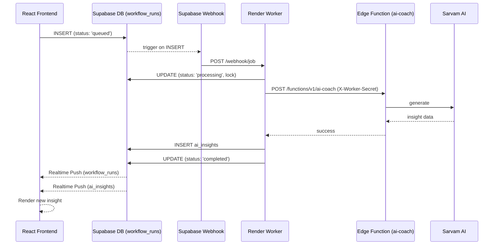

# LockIn Event-Driven Architecture

This document describes the complete production-grade, event-driven backend architecture for LockIn. The core philosophy is **Zero Frontend Orchestration**: the React browser client never orchestrates multi-step AI workflows, nor does it poll for completion. It simply enqueues tasks and reacts to database updates in real-time.

## System Components

### 1. React Frontend
- **Responsibilities**: Render UI, handle user input, enqueue background tasks, and subscribe to real-time database changes.
- **Tools**: Vite, React, Framer Motion, Supabase Realtime.
- **Workflow**: 
  - To trigger AI (e.g. Daily Review), the frontend calls `enqueueDailyReview()` which inserts a record into `workflow_runs`.
  - The UI (e.g. `WorkflowMonitor.tsx`) listens to `workflow_runs` via Supabase Realtime to show progress.
  - The UI listens to `ai_insights` via Supabase Realtime to render the final result.

### 2. Supabase (Database & Realtime)
- **Tables**: 
  - `workflow_runs`: The central queue. Contains status (`queued`, `processing`, `completed`, `failed`), `worker_id`, `idempotency_key`, and `logs`.
  - `ai_insights`: The final output storage.
- **Webhooks**: 
  - A Supabase Database Webhook listens for `INSERT` on `workflow_runs` where `status = 'queued'`. 
  - It fires an immediate HTTP POST request to the Render Worker.
- **Realtime**: Pushes `UPDATE` and `INSERT` events back to all connected React clients.

### 3. Render Web Service (Node.js Worker)
- **Responsibilities**: Consume the job queue, execute AI workflows, handle retries, and push logs.
- **Architecture**:
  - `index.ts`: Express server exposing `/webhook/job` (for immediate execution) and `/cron/*` (for scheduled execution).
  - `dispatcher.ts`: The core execution engine. Handles optimistic locking (to prevent duplicate execution), exponential backoff retries, and updates `timeline` logs.
  - `registry.ts`: Maps workflow names to their specific `jobs/*.ts` handlers.
- **Authentication**: Holds `SUPABASE_SERVICE_ROLE_KEY` to bypass RLS, and `WORKER_SECRET` to authenticate itself to the Edge Function.

### 4. Supabase Edge Function (`ai-coach`)
- **Responsibilities**: Securely hold the Sarvam AI API key and execute the HTTP request to the LLM.
- **Authentication**: 
  - It **strictly requires** the `X-Worker-Secret` header to match its own `WORKER_SECRET` environment variable.
  - This guarantees the Edge Function cannot be invoked directly by a malicious frontend client or unauthorized party.

### 5. Sarvam AI
- **Responsibilities**: The underlying LLM provider for heavy reasoning tasks (Task Breakdown, Task Summary, Daily Review, Session Reflection, Burnout Detection).

---

## Deployment Guide (Render)

To deploy the Worker securely to Render:

### 1. Create a Render Web Service
1. Connect your GitHub repository to Render.
2. Select the **Web Service** type.
3. Configure the following:
   - **Root Directory**: `worker`
   - **Build Command**: `npm install && npm run build` (Ensure you add a `build` script to `worker/package.json` like `"build": "tsc"`, or deploy directly from TS via `ts-node`).
   - **Start Command**: `npm start` (or `npx ts-node src/index.ts`).

### 2. Configure Environment Variables
You must add the following environment variables in Render:
- `SUPABASE_URL`: Your Supabase project URL.
- `SUPABASE_SERVICE_ROLE_KEY`: Your Supabase service role key (Never expose to frontend!).
- `PORT`: Automatically set by Render, but usually `10000`.
- `WORKER_SECRET`: A randomly generated secure string (e.g., `openssl rand -hex 32`).

### 3. Configure Supabase Edge Function
1. In your Supabase Dashboard, go to **Edge Functions** -> `ai-coach`.
2. Add the exact same `WORKER_SECRET` you generated above to the Edge Function's environment variables.
3. Deploy the function: `supabase functions deploy ai-coach`.

### 4. Configure Supabase Webhook
1. In your Supabase Dashboard, go to **Database** -> **Webhooks**.
2. Create a new Webhook:
   - **Name**: `worker_dispatch`
   - **Table**: `workflow_runs`
   - **Events**: `Insert`
   - **Condition**: `status = 'queued'`
   - **Type**: HTTP Request
   - **Method**: POST
   - **URL**: `https://<YOUR_RENDER_URL>/webhook/job`
   - **Headers**: Add `Content-Type: application/json`.

### 5. (Optional) Configure Render Cron Jobs
If you want automatic scheduled tasks (like a daily cleanup), set up Render Cron Jobs pointing to your Web Service endpoints:
- **URL**: `https://<YOUR_RENDER_URL>/cron/cleanup`
- **Schedule**: `0 0 * * *` (Daily at midnight)

---

## Data Flow Diagram

